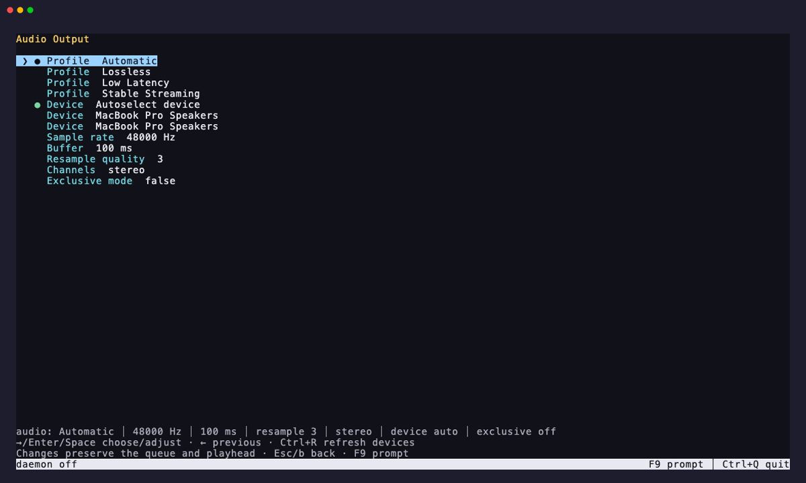

# Audio output



Chill decodes audio to float PCM, applies speed, mono, and equalizer settings,
and sends it to an embedded native output backend. The visualizer observes
consumed samples before output volume and mute. Output settings apply to stations, podcasts,
local media, direct URLs, and provider tracks in daemon and foreground mode.

Saved volume levels retain the previous cubic gain curve, so upgrading preserves
listening levels. Native sample-rate conversion uses a band-limited filter to
prevent aliasing when playing high-resolution audio at a lower output rate.
MP3 playback honors Xing/LAME encoder delay and padding, including duration and
seek positions. Chained Ogg Vorbis sources continue across song boundaries.

## Profiles

| Profile | Sample rate | Buffer | Resampling |
| --- | ---: | ---: | ---: |
| Automatic | 48 kHz | 100 ms | 3 |
| Lossless | 96 kHz | 250 ms | 4 |
| Low Latency | 48 kHz | 50 ms | 2 |
| Stable Streaming | 48 kHz | 2000 ms | 3 |

Changing an individual sample rate, buffer, or resampling value selects Custom.
Supported sample rates are 44.1, 48, 88.2, 96, 176.4, and 192 kHz. Buffer size
ranges from 50 to 5000 milliseconds and resampling quality from 1 to 4.

The buffer setting controls the output queue. Network playback also reads ahead
independently to absorb uneven delivery, including with Automatic selected.
If that reserve runs out, playback waits for it to refill before resuming.
Low Latency keeps a smaller network reserve to stay closer to a live stream.
Local files begin playing without this extra buffering.

```sh
chill audio
chill audio profile Lossless
chill audio sample-rate 96000
chill audio buffer 250
chill audio resample-quality 4
chill audio channels mono
chill audio exclusive on
chill mono toggle
```

The equivalent startup flags are `--audio-profile`, `--sample-rate`, `--buffer`,
`--resample-quality`, `--mono`, and `--device`. They work with ordinary daemon
playback and `--fg`.

## Devices

`chill device list` reports stable native output identifiers and marks
the selected preference. `chill device set <id-or-name>` accepts an exact id,
an exact display name, or one unambiguous partial match. `chill device default`
returns to automatic system routing.

Device-only changes are applied without restarting the decoder. Format changes
restart the PCM pipeline at the same finite-media position and retain the
current item and queue. If a remembered device disappears, Chill switches to
`auto`; it switches back when that device is available again.

Press **F9** for the live settings screen. Enter chooses a profile or device.
Left and right cycle advanced values, and `Ctrl+R` refreshes device discovery.

`status --json` includes desired settings, active device, active sample rate,
and the PCM format. `chill doctor` checks device enumeration and reports an
unavailable saved selection.

The active backend uses CoreAudio on macOS, WASAPI on Windows, and PulseAudio
or ALSA on Linux. Selecting an output changes only Chill's routing. Existing
saved device identities remain accepted. Exclusive mode is available only when
the selected backend and device support it; a failed request retains the
previous configuration. PulseAudio shared outputs do not support exclusive mode.

The Lossless profile increases processing precision and sample rate; system
mixers and device conversion may still apply. `active_sample_rate` is the PCM
pipeline rate; `device_sample_rate` is the rate negotiated with the audio backend.
JSON audio status also reports `backend`, `active_exclusive`, and
`output_latency_ms`: how long samples stay in the backend's buffers after Chill
hands them over, which is also how far the visualizer and `runtime.spectrum`
run ahead of the backend's output. The output device's own latency, which is
large for Bluetooth, comes on top.

Use `chill doctor --audio` to explicitly open and close the chosen output without
playing sound. Plain `chill doctor` only enumerates devices.
