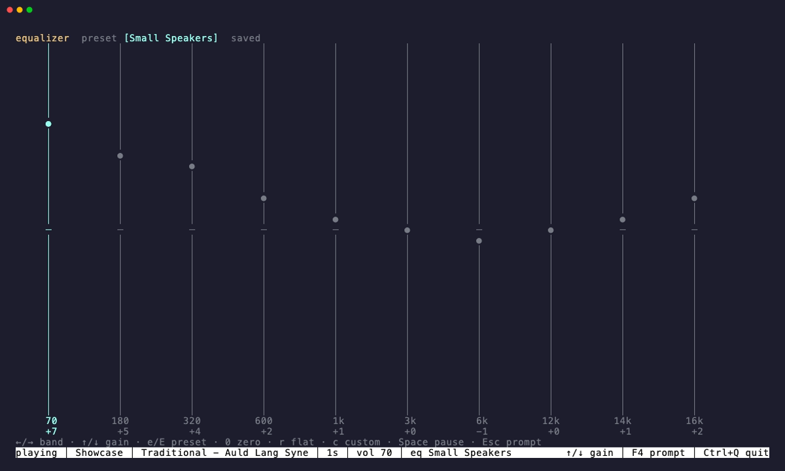

# Equalizer architecture



## Signal path

Every radio station and podcast uses the same stereo float32 PCM path at the configured sample rate:

```text
native/FFmpeg decoder → speed/mono → ten peaking biquads → native output
                                  └→ bounded visualizer tap
```

The fixed center frequencies are 70, 180, 320, 600, 1,000, 3,000, 6,000,
12,000, 14,000, and 16,000 Hz. Each filter has Q 1.4 and a gain range of -12 to
+12 dB. Steady-state Flat is a true bypass: PCM bytes are not rewritten when
every band is zero. Live changes ramp filter coefficients over 10 ms to avoid discontinuities.
The complete target curve is exchanged atomically between the control and audio
goroutines; only the decoder goroutine owns filter history.

The visualizer consumes the post-EQ samples before output volume and mute. This
makes the displayed spectrum reflect audible tone changes without making its
level depend on the output volume.

## Presets and Custom

The built-ins are Flat, Rock, Pop, Jazz, Classical, Bass Boost, Treble Boost,
Vocal, Electronic, Acoustic, Hip-Hop, R&B, Loudness, Late Night, Podcast, and
Small Speakers. Custom follows the built-ins when cycling.

Editing any band copies the currently audible curve into Custom before changing
that band. Selecting a built-in never overwrites the saved Custom curve, so the
user can audition presets and return to their work. `state.json` stores the
active preset and all ten Custom gains beside the persisted volume. Older
volume-only state files migrate to Flat when read.

## Control surfaces

- `chill eq` reports the active preset and all band gains.
- `chill eq <preset>`, `next`, and `prev` select a curve.
- `chill eq --band <0-9|frequency> <-12..12>` edits Custom.
- `chill eq list` prints every built-in plus Custom.
- `--eq <preset>` selects a startup curve for station, podcast, REPL, or
  foreground startup.
- The REPL provides the same commands, multi-word preset completion, and an F4
  full-screen editor whose saves are coalesced without blocking input.
- Foreground mode uses the same DSP and persistence, with band and preset keys
  shown on screen.

Daemon status includes `eq_preset` and the ten active `eq_bands`. Preset and
Custom state is included in daemon upgrade snapshots and reapplied before audio
starts, including reconnects and podcast seeks.

## Verification

Unit tests cover bypass identity, center-frequency boost and cut, stereo
isolation, decoder block boundaries, live transitions, concurrent controls,
strict command validation, persistence migration, daemon replacement, TUI
layouts, foreground controls, and the native and FFmpeg PCM paths. The DSP hot
path performs no allocations.
