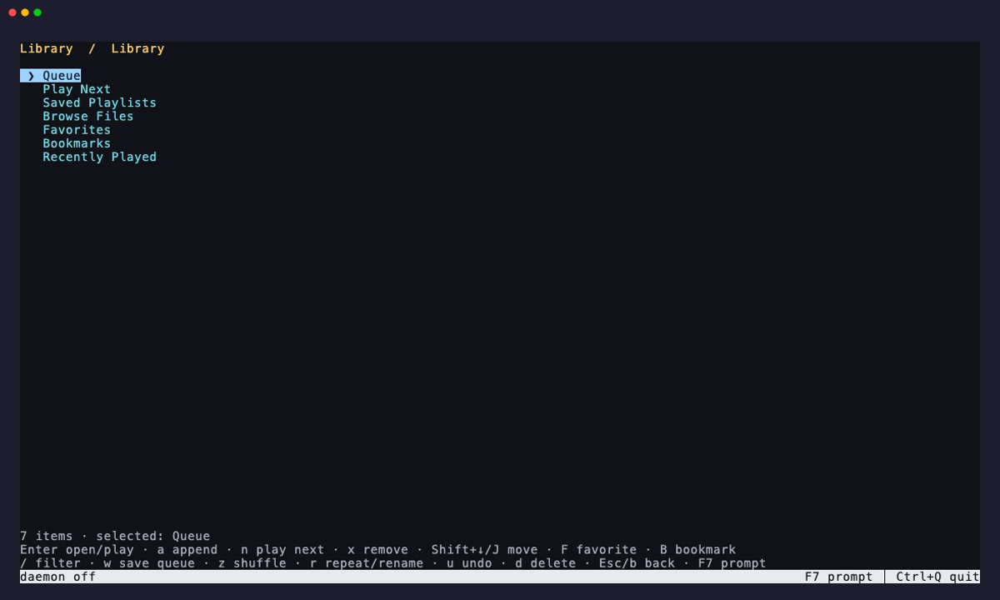

# Library, queues, and playlists



Every playable source uses the same queue item: configured and discovered
stations, podcast episodes, local audio, direct HTTP(S) audio, and entries from
M3U, M3U8, or PLS files. Queue state, shuffle, repeat, undo history, saved
playlists, favorites, bookmarks, recent media, and local resume positions live
in `library.json` beside `stations.json`.

Favorites are one source-neutral collection. A station favorited in radio
discovery appears in the F7 Favorites view, while the F5 Favorites view shows
the station subset of that same collection. Favorite order is preserved.

## Local media

Pass files and folders directly, use `play`, or open the F7 browser:

```sh
chill song.flac
chill ~/Music
chill play disc-1 disc-2
chill album.m3u8 --fg
chill open
```

Folders are scanned recursively in path order. Supported extensions are AAC,
AIFF, ALAC, FLAC, M4A, MP3, MP4, OGA, OGG, Opus, WAV, WebM, and WMA. ffprobe
reads title, artist, album, genre, duration, and embedded lyrics. Embedded cover
art is extracted once into Chill's cache. Consecutive local tracks prewarm the
next FFmpeg decoder and feed one continuous mpv PCM stream for gapless changes.

Finite media saves progress every 15 seconds and when paused, sought, switched,
or stopped. Returning to an unfinished item resumes five seconds early after
the first 15 seconds. Completion is the final minute, or halfway through media
shorter than two minutes. Embedded lyrics are preferred before an online lookup.

## Queue commands

```sh
chill queue
chill queue search moon
chill queue add ~/Music/Album
chill queue add chillhop
chill queue next song.flac
chill queue replace mix.m3u
chill queue play 3
chill queue move 4 1
chill queue remove 2
chill queue undo
chill queue clear
chill shuffle on
chill repeat one
chill repeat all
```

`play next` is a priority lane ahead of ordinary pending items. A later
play-next request goes first while preserving the order of items added together.
Queue edits keep up to 20 undo snapshots. The pending queue and complete
repeat-all cycle survive daemon restarts and upgrades. `queue --json` and
`status --json` expose the same state used by the REPL, F7 browser, foreground
player, and native media controls.

## Saved playlists

```sh
chill playlist list
chill playlist show commute
chill playlist create commute song.flac ~/Music/Album
chill playlist add commute another.flac
chill playlist save current-session
chill playlist play commute
chill playlist play commute --fg
chill playlist move commute 8 2
chill playlist remove commute 4
chill playlist dedupe commute
chill playlist rename commute train
chill playlist import favorites.m3u8 --name favorites
chill playlist export favorites -o favorites.pls
chill playlist delete train
```

Imports resolve relative paths against the playlist location and relative URLs
against the playlist URL. Negative EXTINF or PLS lengths are treated as live
stations. Export format follows `--format m3u|m3u8|pls` or the output extension;
without `-o`, content is written to stdout.

## F7 browser

The home screen opens Queue, Play Next, Saved Playlists, Browse Files,
Favorites, Bookmarks, and Recently Played. Enter opens or plays. `a` appends a
file or folder, `n` places it next, `x` removes an item, `J/K` reorders, and `u`
undoes a queue edit. `w` saves the queue, `f` and `B` toggle the selected
favorite and bookmark, `z` toggles shuffle, and `r` cycles repeat or renames an
open playlist. `/` filters the current view, Esc goes back, and F7 returns to
the prompt.

The command-line equivalents `chill library recent`, `chill library favorites`,
and `chill library bookmarks` support `--json`. `library play`, `library add`,
and `library next` act on a numbered item from one of those collections.
