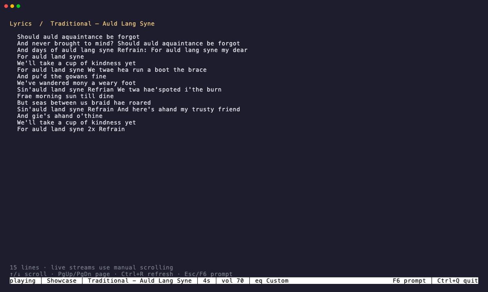

# Now playing



Live radio has no universal metadata channel, so Chill handles the formats used
in practice. For direct HTTP audio it asks for ICY metadata and removes metadata
blocks from the same connection that feeds FFmpeg. This preserves the one-stream
playback design. Playlist and segmented streams are opened by FFmpeg, and Chill
recognizes the title metadata FFmpeg reports. Streams without useful metadata
continue playing normally.

The current value appears in `chill status`, `chill status --json`, the REPL,
foreground mode, history, lyrics, notifications, and native media surfaces. A
metadata change never restarts or delays audio.

## History

`chill history` shows the newest heard tracks first. Consecutive repeats from
the same station are coalesced for five minutes, and the newest 200 entries are
kept.

```sh
chill history
chill history --limit 20
chill history --json
chill history clear
chill history clear --json
```

History is stored in `tracks.json` beside `stations.json`. It contains the
station name and URL, raw metadata, parsed artist and title, artwork URL, and
UTC play time. Writes are locked and atomic. The radio browser's Recently Heard
view can replay the station associated with an entry.

## Lyrics

Press F6 in the REPL, press `y` during foreground playback, or run `chill
lyrics`. The lookup uses the parsed artist and title from the current live
track. `chill lyrics --json` returns the provider result for scripts.

Lyrics are fetched from LRCLIB without an account or API key and cached beneath
the operating system's user cache directory. Exact matches are preferred, with
a bounded search fallback. Plain lyrics are used when available; timestamps are
removed from synchronized lyrics. Instrumental results are identified. Live
radio uses manual scrolling because metadata normally changes after a song has
already started and does not provide a trustworthy timeline.

The lyrics view refreshes automatically when the station announces a new track.
Use Up/Down or j/k to scroll, PgUp/PgDn to page, Ctrl+R to retry, and Esc or F6
to return to the prompt.

## Notifications

Track-change notifications are opt-in:

```sh
chill notifications       # show the saved setting
chill notifications on
chill notifications off
```

The preference survives restarts and applies to daemon and `--fg` playback.
Notifications include the parsed track, artist, station, and artwork when the
desktop supports it. They are dispatched asynchronously and cannot interrupt
the audio path. Linux uses the desktop notification service, macOS uses
Notification Center, and Windows uses an in-process Windows Runtime toast.
On the first Windows toast, Chill associates its application identifier with a
`Chill.lnk` Start Menu shortcut so notifications have stable app identity and
remain grouped in Action Center. Each track replaces the previous now-playing
toast and expires after two minutes.
