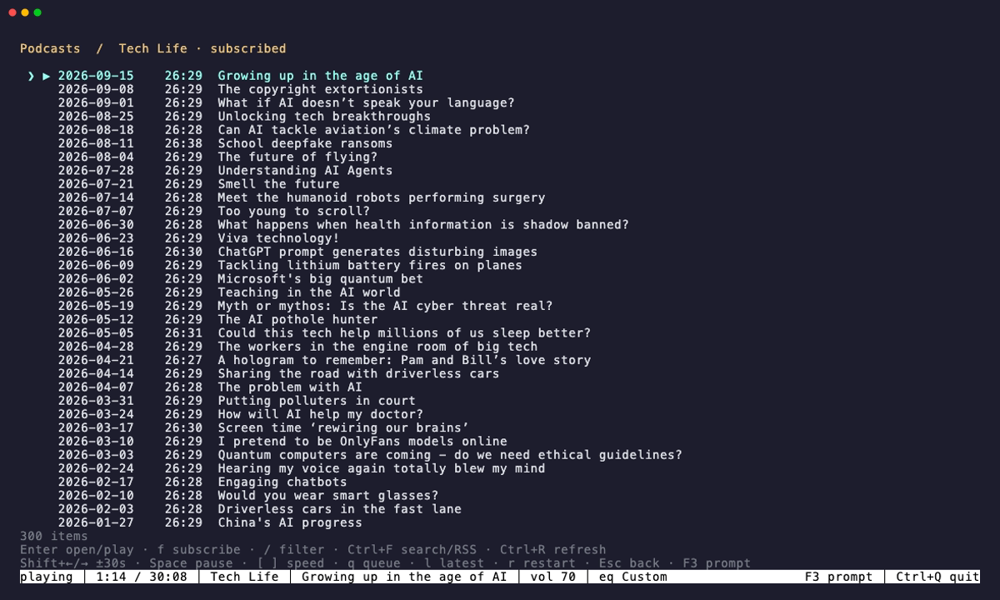

# Podcasts



Run `chill podcasts`, type `podcasts` in the REPL, or press F3. The browser has
Top Shows, Categories, Subscriptions, and Search. The top chart defaults to the
US; `chill podcasts country gb` saves a different two-letter country code.
Categories use Apple's genre-filtered search. No account or API key is needed.

## Browser keys

| Key | Action |
| --- | --- |
| Up / Down, PgUp / PgDn | Browse the list |
| Enter | Open a show or play an episode |
| f | Subscribe or unsubscribe from the selected show |
| / | Filter the list; search from the home screen |
| Ctrl+F | Search shows or paste an RSS URL |
| Ctrl+R | Refresh the current list or feed |
| q | Queue the selected episode |
| l | Queue the newest episode of the selected show |
| r | Restart the selected episode |
| Shift+Left / Shift+Right | Skip back / forward 30 seconds |
| Space | Pause or resume |
| [ / ] | Decrease / increase speed by 0.25x |
| Esc | Go back; close the browser from its home screen |
| F3 | Return directly to the REPL prompt |
| Ctrl+C | Cancel a pending request |
| Ctrl+Q | Quit the REPL; playback continues |

Letter shortcuts apply inside the browser, not while typing a search or command.
The browser preserves your prompt draft. Returning to the prompt lets you use
the visualizer, station commands, volume, mute, and sleep timer as usual.

## Command line

```sh
chill podcasts
chill podcasts https://example.com/feed.xml
chill podcasts top --country us
chill podcasts search "science" --json
chill podcasts categories
chill podcasts category "True Crime"
chill podcasts episodes https://example.com/feed.xml
chill podcasts subscribe https://example.com/feed.xml
chill podcasts subscriptions --json
chill podcasts unsubscribe https://example.com/feed.xml
chill podcasts country gb
chill podcasts play https://example.com/feed.xml 3
chill podcasts play https://example.com/feed.xml 3 --restart
chill podcasts latest https://example.com/feed.xml
chill podcasts queue https://example.com/feed.xml 4
chill podcasts queue --json
chill podcasts clear
chill seek -30
chill seek +30
chill --seek 2m
chill speed 1.5
chill next
chill prev
chill pause
chill resume
chill status --json
```

Episode numbers refer to `podcasts episodes` output. Without a number, `play`
and `queue` select the newest published episode, falling back to feed order.
`next` plays the next queued episode. `prev` restarts the current episode after
three seconds of playback, or returns to the previous episode near the start.
The queue plays in order and stops when empty. Loading a radio station or
stopping the daemon clears it.

`podcasts --help` lists the commands. `podcast` is also accepted. Listing and
search commands support `--json`; they do not start audio playback. Subscribing
starts an idle daemon if needed so multiple clients share one writer.

## Saved progress

Subscriptions, chart country, playback speed, and progress are saved in `podcasts.json` beside
`stations.json`. The daemon saves progress every 15 seconds and when pausing,
seeking, switching, or stopping. Closing the REPL does not stop these updates.

Returning to an episode resumes five seconds before the saved position. The
first fifteen seconds restart from the beginning. Finished episodes are marked
played; stopping within the final minute also counts, or past halfway for an
episode shorter than two minutes. `--restart` bypasses the saved position.

Episodes are identified by feed and publisher ID, with publication metadata as
a fallback. New signed audio URLs therefore usually retain the same progress.
An unreadable or newer-format save file is left untouched and reported as an
error. The most recent 2,000 episode records are kept.

## Playback

mpv plays the audio; FFmpeg decodes it and ffprobe measures the episode length.
`chill doctor` checks all three. ffprobe comes with normal FFmpeg installations.
It also checks that the saved podcast settings can be read.
Feed durations are estimates and are replaced with the measured length when
the download finishes.

Audio downloads to a temporary file while playing. Seeking reuses that download
and may briefly buffer if the requested bytes have not arrived. Each download
is limited to 1 GiB and removed when playback switches or stops. This is not an
offline download library. Feed reading is limited to 300 playable episodes and
32 MiB per response; RSS and Atom audio enclosures are supported.
