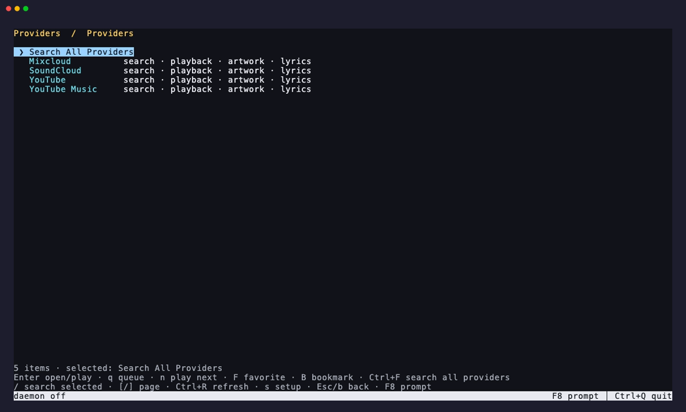

# Providers and search



Provider items keep a stable provider key and catalog id independently of a
temporary stream URL. That identity survives queues, playlists, favorites,
bookmarks, history, daemon restarts, and stream re-resolution.

Built-in catalog adapters cover YouTube, YouTube Music, SoundCloud, Mixcloud,
Navidrome/Subsonic, Plex, Jellyfin, Emby, Audiobookshelf, Spotify, Tidal, and
Qobuz. Each adapter advertises only the search, browse, playback, preview,
artwork, playlist, favorite, progress, and authentication capabilities it
implements. Spotify, Tidal, and Qobuz are catalog integrations: Chill plays an
explicit preview when the service returns one and never presents that preview
as a full track. Full-track playback remains available for self-hosted and
extractor-backed providers. Catalog-only rows are labeled and cannot be played
or added to a playback queue; collection links include only playable previews.

## Setup

```sh
chill setup
chill setup navidrome
chill providers
chill providers --check
chill providers --json
```

The setup screen masks secrets and validates the connection before saving it.
Non-secret configuration is stored in `providers.json`; passwords, access
tokens, client secrets, and refresh tokens are stored in
`provider-secrets.json`. Both files are written atomically and the secrets file
is owner-readable only. Remote HTTP servers must use HTTPS; loopback servers may
use HTTP.

YouTube-family, SoundCloud, and Mixcloud accounts can optionally name a browser
cookie store such as Firefox, Chrome, Safari, or Edge. The same cookie selection
is used for search and playback resolution. Self-hosted providers use their
server URL and account token or password. Hosted catalogs accept account access
credentials supplied by the service.

## CLI

```sh
chill search "boards of canada"
chill search ambient --provider ytmusic --limit 10
chill search ambient --queue all
chill search ambient --next all
chill search ambient --play 1 --fg
chill browse navidrome albums
chill browse navidrome album <id> --queue all
chill browse spotify playlists --json
```

Collection rows include the stable id accepted by the follow-up album,
artist, playlist, library, or item command.

Global search runs enabled providers concurrently, returns incremental sections
in the TUI, removes duplicate provider identities, and stops outstanding work
when canceled. CLI search and browse support `--play`, `--queue`, `--next`,
`--limit`, `--offset`, `--json`, and `--fg` where the selected action permits
foreground playback.

Press **F8** for the provider browser. `Ctrl+F` searches all enabled providers,
Enter opens a collection or plays a track, `q` appends, `n` plays next, `f`
toggles the global favorite, and `B` toggles a bookmark. `/` filters visible
rows, brackets page, `Ctrl+R` refreshes, and `s` opens provider setup.

Full tracks and explicit previews use the same queue, EQ, visualizer, lyrics,
notification, resume, native media-control, and audio-output paths as every
other source. Supported servers receive playback progress and favorite changes
without replacing the local durable state.
