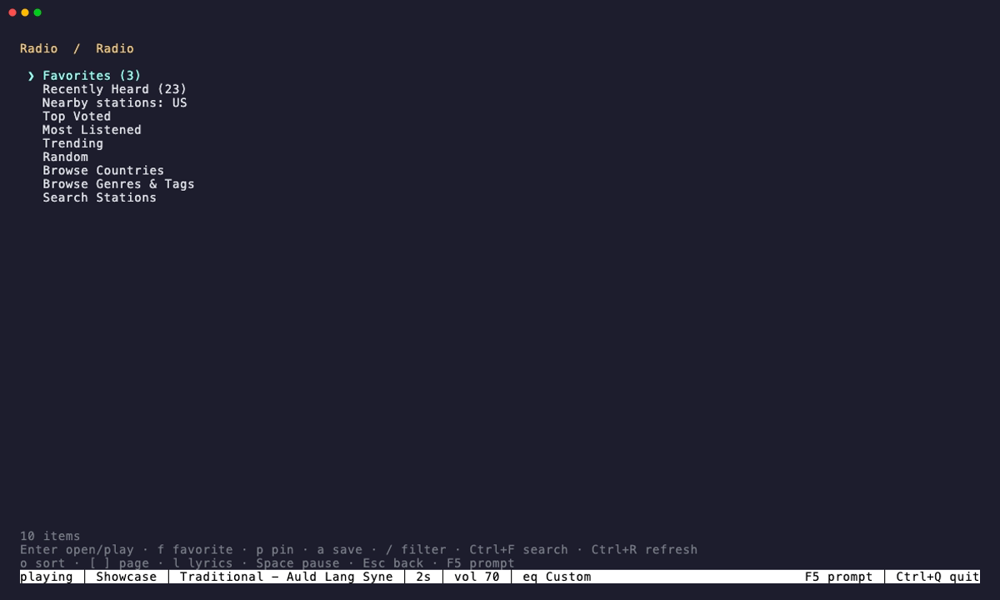

# Radio discovery



Run `chill radio`, enter `radio` in the REPL, or press F5. The browser opens on
favorites, recently heard tracks, optional nearby suggestions, pinned views,
four charts, countries, genres and search. Directory playback does not modify
`stations.json`; favorite a result when you want it to persist in the browser.

The directory is public and requires no account or API key. Chill discovers its
current HTTPS mirrors through DNS, randomizes them, remembers the healthy one,
and fails over when a request cannot be completed. Search and browse requests
send the selected filters to the directory service. Playing a result sends its
directory identifier back as a click count. Chill does not send its track
history or favorites.

## Browser keys

| Key | Action |
| --- | --- |
| Up / Down, PgUp / PgDn | Browse the current list |
| Enter | Open a view or play a station |
| `/` | Filter the current list |
| Ctrl+F | Search station names |
| f | Favorite or unfavorite the selected station |
| p | Pin or unpin the selected country, region, or tag |
| a | Save the selected result to `stations.json` |
| o | Cycle top, popular, trending, name, and random sorting |
| Ctrl+R | Refresh the current view |
| [ / ] | Previous or next result page |
| l | Open lyrics for the current live track |
| Esc / b | Go back; return to the prompt from the home screen |
| F5 | Return directly to the REPL prompt |
| Ctrl+C | Cancel a pending directory request |
| Ctrl+Q | Quit the REPL; playback continues |

Typing filters local results immediately. Searching from the home screen makes
a directory query. Country views first offer all stations and then each region.

## Command line

```sh
chill radio top
chill radio --fg
chill radio popular --limit 25 --offset 25
chill radio trending --json
chill radio random --play 1
chill radio search "ambient jazz" --language english
chill radio country us --state California
chill radio tag synthwave --sort popular
chill radio countries
chill radio tags
chill radio favorites
chill radio favorite https://example.com/live "Example FM"
chill radio unfavorite https://example.com/live
chill radio play https://example.com/live "Example FM"
chill radio play https://example.com/live "Example FM" --fg
```

`top`, `popular`, `trending`, `random`, `search`, `country`, `tag`, and
`favorites` produce numbered station lists. Use `--play N` to play a result or
`--favorite N` to toggle it. `--sort` accepts `top`, `popular`, `trending`,
`name`, or `random`; `--limit` accepts 1 through 200. `--json` returns the
directory objects without starting playback. `chill radio --fg` carries the
station selected in the browser into the foreground player; `--fg` also works
with `play` and `--play N`.

## Nearby suggestions

The first browser visit asks before offering nearby stations. Consent reads the
system timezone or locale and uses the operating system's installed timezone
table. It does not call a location service, inspect an IP address, or request
precise location. The choice is stored locally. The nearby entry opens the top
stations for that country directly. If suggestions are disabled, the entry
remains available so they can be enabled later.

```sh
chill radio nearby auto   # infer locally now
chill radio nearby us     # choose explicitly
chill radio nearby none   # disable nearby suggestions
chill radio nearby ask    # ask again in the browser
```

Favorites, pins, and the nearby choice are stored in `radio.json` beside
`stations.json`. Writes are locked and atomic so concurrent CLI and REPL
changes do not lose data. The file is portable across supported platforms.
