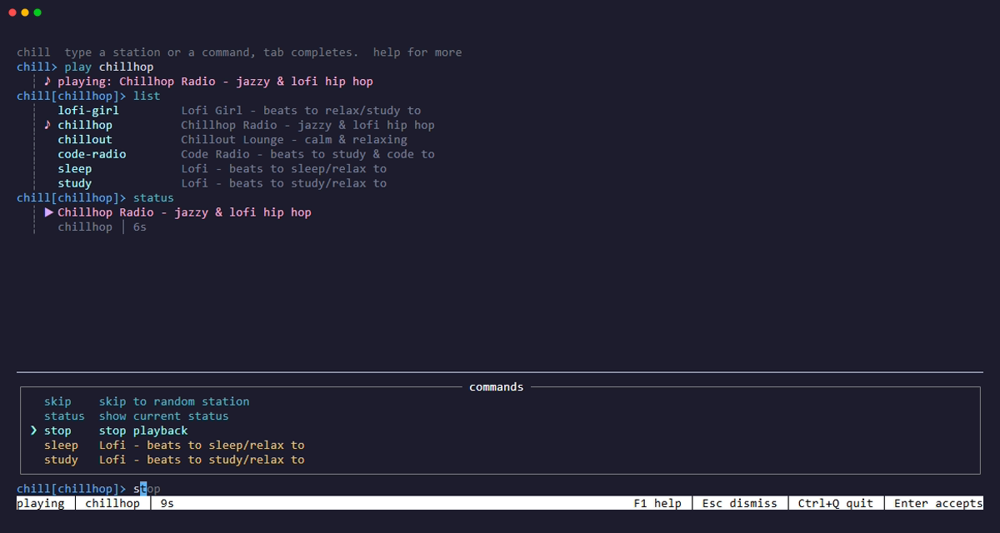

# REPL visualizer architecture

## Audio ownership

The daemon owns playback for the lifetime of a station. `pcmPlayer` implements
the existing `player` interface, so volume, mute, pause, sleep, reconnects and
daemon upgrades retain the same control path. Each player owns:

1. A cancellable source, with yt-dlp used only for supported website pages.
2. A built-in decoder for MP3, FLAC, PCM WAV, or Vorbis, with FFmpeg for additional
   formats and segmented streams.
3. Sample-rate conversion, pitch-preserving speed, mono processing, and the
   existing ten-band equalizer.
4. Bounded PCM transport into an embedded native output device.
5. A separate bounded analysis ring fed from consumed, post-EQ, pre-volume samples.

The device callback performs no decoding, FFT, network access, or process waits.
Analysis runs independently, so slow subscribers cannot delay audio. Callback
consumption drives position and the visualizer; backend hardware buffering can
still add presentation latency.

Cancellation closes sources, wakes blocked producers, and terminates and reaps
owned subprocess trees. Track completion waits for queued samples to drain.
Missing optional tools produce an actionable error instead of a reconnect loop.
There is no second live stream connection for analysis.

## Analysis contract

`audio.Frame` has fixed-size arrays and contains no UI state:

- 2,048-sample Hann-windowed FFT, 64 logarithmic bands from 30 Hz to 20 kHz.
- Stereo power combined **after** FFT, avoiding anti-phase cancellation.
- Independent left/right linear sample peak and RMS.
- Contiguous stereo samples for scope and phase displays.
- Timestamp and sequence for identifying absent/stale audio.

The analysis point is after Chill's equalizer and before output volume/mute. UI
labels call this post-EQ audio: changing the curve changes the picture, while a
volume or mute change does not.

## Transport and lifecycle

The daemon protocol is version 4. The `visualize` request upgrades its
connection to newline-delimited JSON snapshots (`version: 1`) at 30 Hz. It is
read-only, uses a dedicated connection and does not start playback. A packet
contains playback state, station generation and an `audio.Frame`.

The server never holds the daemon control mutex while analyzing or writing.
Writes have a 250 ms deadline; disconnected or blocked clients are discarded.
No subscriber means no FFT. Paused/loading/idle states do not request analysis.

The REPL has at most one asynchronous read in flight. Hiding the panel closes
the connection; showing it reconnects. Retry ticks and connection results carry
an ID, so late messages cannot revive a disabled view. Help, tiny windows, off,
and shutdown close the subscription. New generations, pause and stale samples
clear presentation state. Multiple REPLs have independent display settings.

## Rendering and controls

`internal/visualizer` depends only on the analysis contract. `Advance` updates
attack/release, peak hold and bounded history; `Render` is a deterministic,
read-only function of mode and dimensions. Render dimensions and history are
capped. Resizing does not advance animation or resize audio buffers.

`tui_visualizer.go` owns layout, focus, commands and subscription lifecycle.
Compact mode sits below the transcript, preserving transcript mouse coordinates.
Fullscreen hides the prompt and transcript without discarding them. F2 focuses
the visualizer; only that focus captures v/V, arrows, Space and o. Esc restores
the prompt, including any draft. `viz` commands run locally even during an
in-flight diagnostic command.

To add a mode, register a stable name in `visualizer.Modes` and implement its
renderer using the existing frame/history. Do not add playback, subprocess or
socket operations to renderers. To replace the audio backend, implement the
existing player contract and optional `audioFrame() audio.Frame` method.

## Verification

- DSP tests use known-frequency stereo tones, phase inversion and silence.
- Renderer tests cover every mode, tiny/resized canvases, purity and peak decay.
- Subscription/UI tests cover slow readers, pause, stale messages and focus.
- `TestPCMIntegration` runs in the normal `go test ./...` suite and exercises
  native/FFmpeg → PCM → native output with local stereo fixtures and a paced test device,
  including start-paused, decoder failure and cleanup. Native tests require no
  external tools; additional codec integration tests use FFmpeg.
- CI installs FFmpeg and exercises playback across macOS, Linux and Windows.
  The separate YouTube workflow verifies the external extractor/network path.
